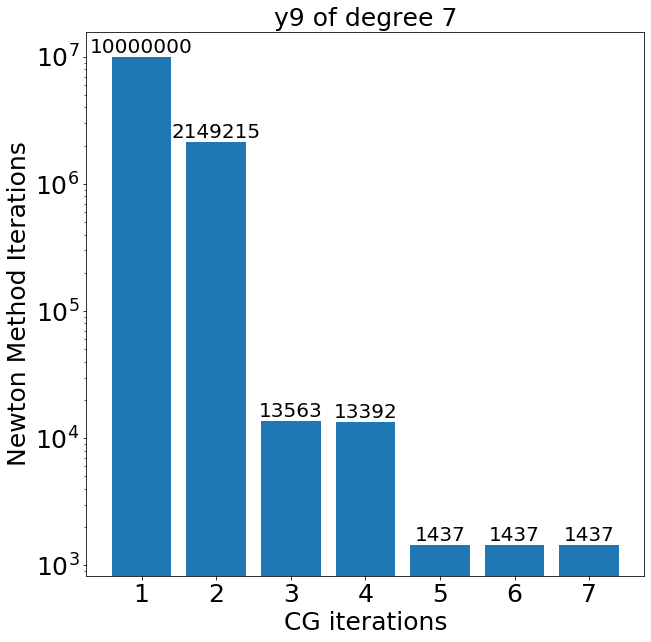

# Exploring Inexact Newton Method with Conjugate Gradient

Steepest descent and Newton's method implementation for Distributed Optimisation and Games Course, UBIINET master 2020

Authors: Igor Dias da Silva and [Younes Ben Mazziane]

## Abstract
In this project, we applied the Newton method along with the conjugate gradient to approximate polynomial functions. We investigated the effects of stopping the conjugate gradient with $ k < d $ iterations and observed that it can be beneficial to do it. 

## Project Report

### 1. Understanding the project
For this project, we chose the proposed subject 4, "Implement the (inexact) Newton method without inverting the Hessian, but using the conjugate gradient method". So basically we have to take Newton method that looks like this:

$$\omega_{k+1} \xleftarrow{} \omega_{k} + \alpha s_{k} $$

$$\nabla^{2} F(\omega_{k}) s_{k}= - \nabla F(\omega_{k})$$

And when we want to solve the system above to find $s_{k}$, we will use the conjugate gradient method. The conjugate gradient is an iterative method, and we want to know what happens if we stop it early. So first, in this section, we look into the conjugate gradient method and how to use it and then in the next section, we show how we implemented the methods and experiments. Finally, we present our results and conclusion. 

### 2. Conjugate Gradient Method

To understand the conjugate gradient method we need to understand the more general case, called conjugate direction method. In conjugate direction method we need to solve a system like:

$$Ax = b$$

Where A is a symmetric definite positive matrix. The motivation to solve this system is that finding $x^{\star}$ that solves the system above is equivalent to finding the critical point of the function given by:

$$f(x) =(1/2)x^{T}Ax - b^{T}x + c$$

To find $x^{\star}$, we need a set of A-orthogonal search directions, $d_{(0)},d_{(1)},...,d_{(n-1)}$ where n is the dimension of x. We will start with $x_{(0)}$, which is a guess of $x^{\star}$ and at each iteration of a conjugate direction method, we update our guess by giving a step in one of the search directions. The idea is to give the perfect step in each search direction, so we only need n iterations to go from our guess $x_{(0)}$ to the correct $x^{\star}$.
This means that after we correct $x_{\left(i\right)}$ regarding one direction $d_{\left(i\right)}$, we do not need to change $x_{(j)}, j>i$ again in this direction because it is already how it should be. So we can write each iteration of conjugate direction methods as:

$$x_{(i+1)} = x_{\left(i\right)} + \alpha_{\left(i\right)}d_{\left(i\right)}$$

Where $d_{\left(i\right)}$ is a search direction and $\alpha_{\left(i\right)}$ is the step size we take in this direction. In this method, the residual at each iteration, given by $r_{\left(i\right)} = b - Ax_{\left(i\right)}$, is orthogonal to all the previous search directions. This means that the set of residuals are independent vectors. Thus we can use Gram-Shmidt on these vectors to construct the A-orthogonal search directions. Which is called the Conjugate Gradient method. Given an initial vector $x_{(0)}$,we initialise the first residual and search direction as below:

$$ r_{(0)} \xleftarrow{}  b - Ax_{(0)}$$

$$ d_{(0)} \xleftarrow{} r_{(0)}$$

Then we follow the next steps iteratively:

1. $$\alpha_{\left(i\right)} = (r^{T}_{\left(i\right)} r_{\left(i\right)}) / (d^{T}_{\left(i\right)} Ad_{\left(i\right)})$$

2. $$x_{(i+1)} = x_{\left(i\right)} + \alpha_{\left(i\right)}d_{\left(i\right)} $$

3. $$r_{(i+1)} = r_{\left(i\right)} - \alpha_{\left(i\right)}Ad_{\left(i\right)} $$

4. $$\beta_{(i+1)} = (r^{T}_{(i+1)} r_{(i+1)}) / (r^{T}_{\left(i\right)} r_{\left(i\right)}) $$

5. $$d_{(i+1)} = r_{(i+1)} + \beta_{(i+1)}d_{\left(i\right)} $$

In 1, we compute the step size. Then in 3, we compute the new residual. Finally, we use 4 and 5 to compute the next direction, which is A-orthogonal to all previous directions. Equations 4 and 5 were obtained using Gram-Schmidt Conjugation to produce the new direction.
In what follows, we will use the conjugate gradient method to solve the system $Ax = b$ in the Newton method and evaluate the effect of using iterations less than $b$.

### 3. Newton Method with Conjugate Gradient

What we want is to find the parameter vector of a polynomial to approximate a data set that for us will be the points generated by a known polynomial. 

$$f(\omega , x) = \omega_{0} + \omega_{1}x + ... + \omega_{n}x^{d-1}$$

We define our loss function as:

$$F(\omega_{k}) = (1/n)\sum^{n}_{i=1}(f(\omega_{k},x) - y)^{2}$$

If we want to find the parameter vector $\omega x^{\star}$ that minimises our loss function $F(\omega)$, we can use the equations of the Newton method and converge to the answer. However, we need to solve the system in the second equation to find $s_{k}$. 

To solve this system, we can look at it as the system we solve in the conjugate gradient method where the hessian of our loss function will be the symmetric definite positive matrix $A$, and the negative gradient $- \nabla F(\omega_{k})$ will be the $b$. So we can solve it with the conjugate gradient method and find $x$ that is our $s_{k}$.

$$\nabla^{2} F(\omega_{k})s_{k} = - \nabla F(\omega_{k})$$
$$Ax = b$$

### 4. Experiments

In our implementation, we receive a series of points $(x_{i},y_{i})$ such that $y_{i} = f(\omega x^{\star},x_{i})$ and we say this is our data set $D$. We consider the dimension of the polynomial we are going to use to predict these points to be the same dimension of the polynomial $f(\omega x^{\star},x)$. So we have an initial parameter vector $\omega_{(0)}$ that we initiate with zeros, and we want to apply the Newton method with the conjugate gradient to converge to $\omega x^{\star}$.

The first thing we do is to write our loss function in a matrix notation given by:

$$ F(\omega_{k}) = (1/2)\omega_{k}^{T}H\omega_{k} - Z^{T}\omega_{k} + C$$
Such that each element of the matrix H is given by:
$$ h_{i,j} = (2/n)\sum_{x \in D} x^{i + j}$$
And each element of the vector B is given by:
$$ b_{i} = (2/n)\sum_{(x,y)\in D} x^{i}y$$
From this notation we know our gradient as:
$$ \nabla F(\omega_{k}) = H\omega_{k} - Z^{T}$$

And the Hessian is simply $H$.

In our experiments, we considered 3 different degrees for the polynomials, 3, 5 and 7. And we used 3 different polynomials for each degree. So we have 9 different functions that we want to approximate using the Newton Method with Conjugate Gradient. For each function, we evaluate the effect of using $i < d$ iterations. $d$ is the degree of the polynomial in the CG method on the number of iterations taken by the Newton method to converge to the optimal solution within a fixed error of $0.1$. We note that if the Newton method iterates and cannot reach this precision within 10 million iterations, we stop the algorithm.

So, for example, for a function that is a polynomial of degree 3, we are going to use another polynomial of degree 3 to approximate it, and we are going to do it three times. In the first time, we will only execute the Conjugate Gradient for 1 iteration, the second time, we are going to execute it for 2 iterations. And finally, in the third time, we are going to execute all 3 iterations.

The functions we considered were:

$$ y_{1} = 1 + 9x + 10x^{2} $$
$$ y_{2} = 2 + 5x + 8x^{2} $$
$$ y_{3} = 3 + 6x + 2x^{2} $$
$$ y_{4} = 5 + 9x + 4x^{2} + 6x^{3} + 3x^{4} $$
$$ y_{5} = 1 + 1x + 2x^{2} + 3x^{3} + 4x^{4} $$
$$ y_{6} = 2 + 6x + 9x^{2} + 5x^{3} + 1x^{4} $$
$$ y_{7} = 1 + 6x + 8x^{2} + 2x^{3} + 3x^{4} + 10x^{5} + 2x^{6} $$
$$ y_{8} = 2 + 10x + 8x^{2} + 1x^{3} + 7x^{4} + 3x^{5} + 9x^{6} $$
$$ y_{9} = 5 + 9x + 10x^{2} + 4x^{3} + 5x^{4} + 5x^{5} + x^{6}$$

### 5. Results

In the figure below, we can see the results we found for the function $y_{9} = 5 + 9x + 10x^{2} + 4x^{3} + 5x^{4} + 5x^{5} + x^{6}$. When we limited the iterations of the conjugate gradient method to a single one, we could not converge to a precision of 0.1 in less than 10 million iterations of the Newton method, so as we said, the algorithm stopped. As soon as we use 2 iterations for the CG method, we can already converge to the precision of 0.1  in 2.1 million steps. This was expected since the more iterations we allow for the CG method, the more precise the $s_{k}$ we compute to converge faster.

What we did not expect is the step we found in all our experiments for the number of iterations close to the number of dimensions. We can see in this example that if we use 5 iterations for the CG method, 6 or 7, we converge to the precision 0.1 with the same number of iterations for the Newton method. This indicates that the last iterations of the conjugate gradient method do not give us much more precision on $s_{k}$, and therefore we do not need to compute all iterations of the conjugate gradient. 

### 6. Conclusion
In conclusion, stopping the conjugate gradient method after $k < d$ iterations can be beneficial because the final iterations of the conjugate gradient have smaller contributions to the precision of $s_{k}$. Even though we did not do a deep study of the state of the art, it would be interesting to investigate how to find the best number of iterations to consider in the conjugate gradient to converge with the Newton method to a given precision faster.

### 7. Bibliography

- Shewchuk, Jonathan Richard. "An introduction to the conjugate gradient method without the agonising pain." (1994): 1.

- Bottou, Léon, Frank E. Curtis, and Jorge Nocedal. "Optimization methods for large-scale machine learning." Siam Review 60.2 (2018): 223-311.

- Bubeck, Sébastien. "Convex optimisation: Algorithms and complexity." Foundations and Trends® in Machine Learning 8.3-4 (2015): 231-357.